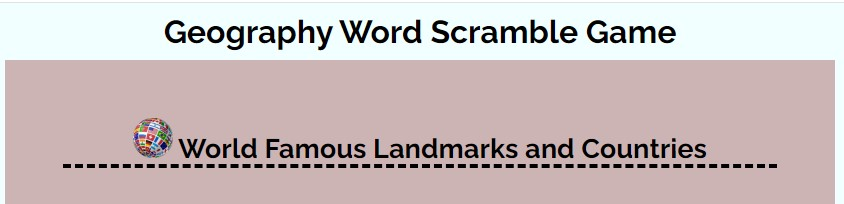

# Geography Word Scramble Game
## Introduction
#### Project Description
Geography Word Scramble is a game that  can be used by school-aged children to have fun while learning iconic landmark locations scattered all over the world
#### Project Purpose
Geography Word Scramble Game is design to enhance geography knowledge, where hints of iconic landmarks are displayed and a corresponding located country is scrambled. It is expected that users  use the hint and scrambled word to identify the correct country where the displayed landmark is located.
Project is generally aimed at improving geography knowledge of users 
#### User Demographic
Primary  user demography are school-age children to improve knowledge of geography hence, attention to details to decipher  the scrambled country name. 
## Design
#### Colour Scheme
#### Topograhy
The Raleway font is used  all through the website. Sans Serif is used as the backup font for any reason the font isn't being imported into the site properly.
#### Imagery
## Features
### Existing Features
#### Title and  Header
Located at the top of the page that clearly states  the game name  and subsequently horn into what game you are playing with world logo appended to it. 
```html

    <title>Geography Word Scramble Game</title>
</head>
<body>
    <h1 class="heading">
        Geography Word Scramble Game
    </h1>
```

 
#### Word Scrambling
The letters of country names that corresponds with the hint are shuffled. Using the code and to make is simpler for school-aged, the country names are shuffles without omitting any letter.
```js
function getRandomInt(n) {
    return Math.floor(Math.random() * n);
  }
  function shuffle(str) {
    let arr = str.split('');           
    let n = arr.length;              
    
    for(let i=0 ; i< n-1 ; ++i) {
      let j = getRandomInt(arr.length);       
      
      let temp = arr[i];             
      arr[i] = arr[j];
      arr[j] = temp;
    } 
    str = arr.join('');                
    return str;                        
  }
```

#### Hint
This is used to display const hint with matches the displayed random shuffled selected country name.
```js
    let index = Math.floor(Math.random() * 41);
    let displayHint = hints[index]; 
    let scrambleWord = document.getElementById("scrambleWord");
     
    displayCountry = country[index]; 
    scrambleWord.innerText = shuffle(displayCountry).toUpperCase();

    let hint = document.getElementById("hint");
    hint.innerHTML = "<b>Hint </b>:" + displayHint;
    document.getElementById("declaration").innerText = "Result:";
```

#### Check Answer
#### Refresh
#### Correct and Incorrect Answer Alert
#### Result
#### Score Count
#### Future features Improvement
## Manual Testing
### Features Testing
### Features Test Result Compilation
### Lighthouse Performance
### Validation Testing
### Browser compatibility
### Screen sizes Responsiveness 
### Pages Responsivnes
### Accessibility
## Technologies Used
### Languages Used
## Bugs
#### Bugs Resolved
#### Bugs Unresolved
### Libraries
## Deployment
## Credits
### Codes
### Tutorials
### Photos
### Text Content