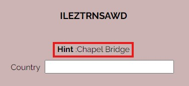
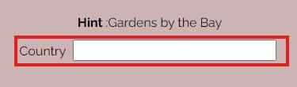
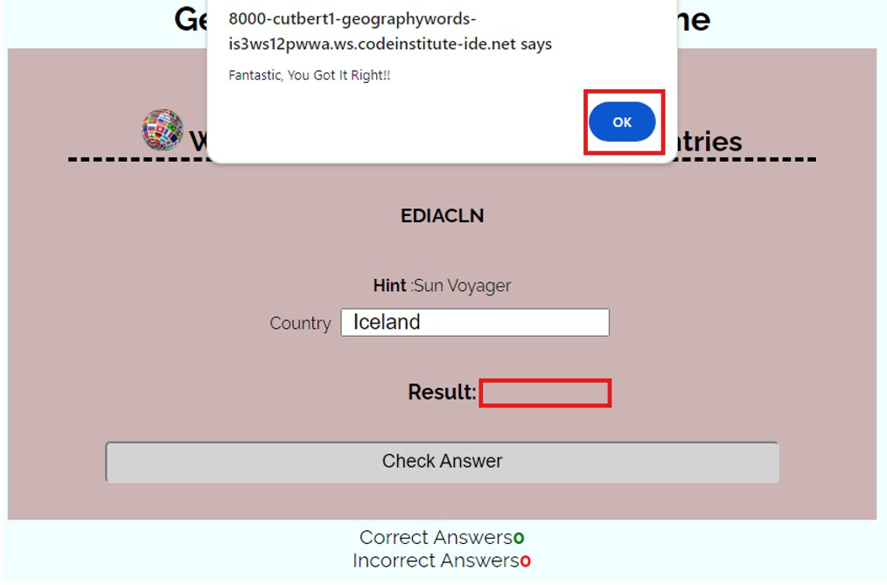
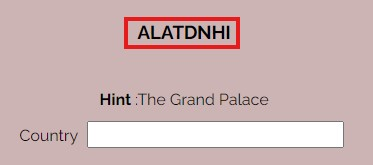
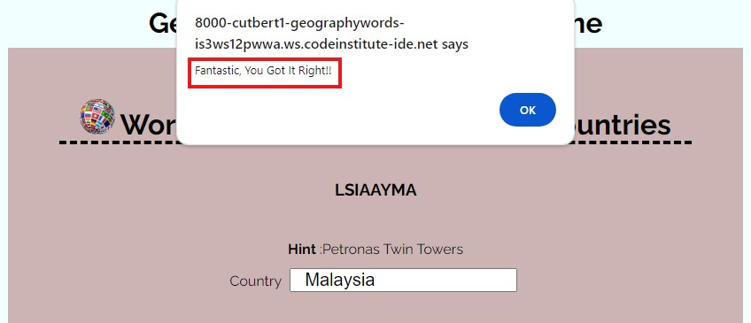
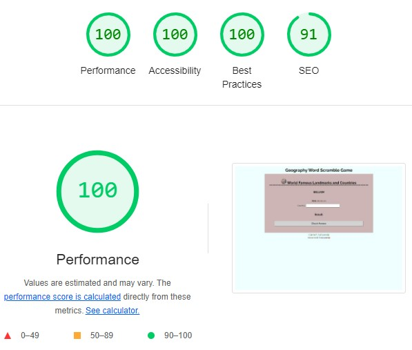
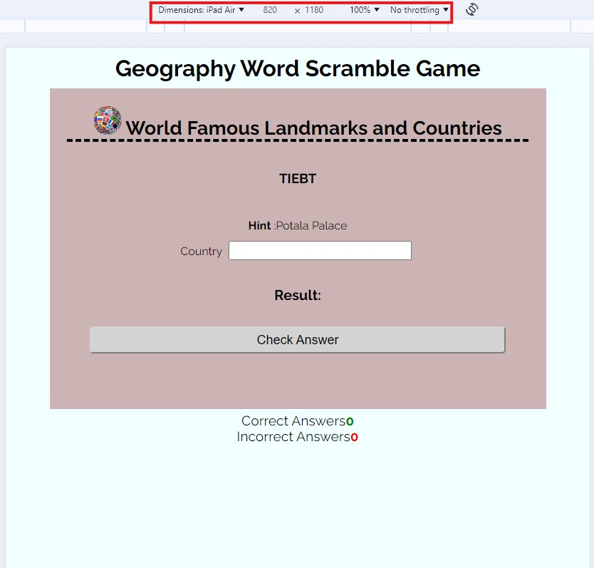
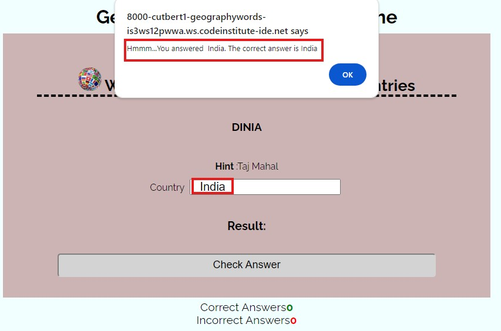
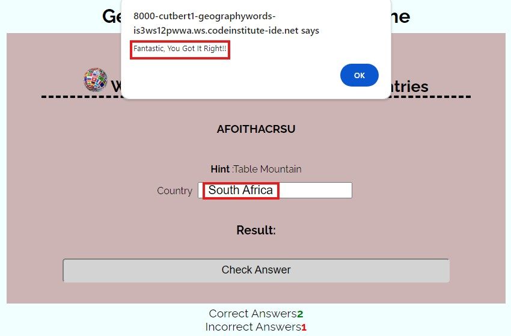

# Geography Word Scramble Game
## Introduction
#### Project Description
Geography Word Scramble is a game that  can be used by school-aged children to have fun while learning iconic landmark locations scattered all over the world
#### Project Purpose
Geography Word Scramble Game is design to enhance geography knowledge, where hints of iconic landmarks are displayed and a corresponding located country is scrambled. It is expected that users  use the hint and scrambled word to identify the correct country where the displayed landmark is located.
Project is generally aimed at improving geography knowledge of users 
#### User Demographic
Primary  user demography are school-age children to improve knowledge of geography hence, attention to details to decipher  the scrambled country name. 
## Design
#### Colour Scheme
#### Topograhy
The Raleway font is used  all through the website. Sans Serif is used as the backup font for any reason the font isn't being imported into the site properly.
#### Imagery
## Features
### Existing Features
#### Title and  Header
Located at the top of the page that clearly states  the game name  and subsequently horn into what game you are playing with world logo appended to it. 
```html

    <title>Geography Word Scramble Game</title>
</head>
<body>
    <h1 class="heading">
        Geography Word Scramble Game
    </h1>
```

 
#### Word Shuffle
The letters of country names that corresponds with the hint are shuffled. Using the code and to make is simpler for school-aged, the country names are shuffles without omitting any letter.
```js
function getRandomInt(n) {
    return Math.floor(Math.random() * n);
  }
  function shuffle(str) {
    let arr = str.split('');           
    let n = arr.length;              
    
    for(let i=0 ; i< n-1 ; ++i) {
      let j = getRandomInt(arr.length);       
      
      let temp = arr[i];             
      arr[i] = arr[j];
      arr[j] = temp;
    } 
    str = arr.join('');                
    return str;                        
  }
```

#### Hint
This is used to display const hint with matches the displayed random shuffled selected country name.
```js
    let index = Math.floor(Math.random() * 41);
    let displayHint = hints[index]; 
    let scrambleWord = document.getElementById("scrambleWord");
     
    displayCountry = country[index]; 
    scrambleWord.innerText = shuffle(displayCountry).toUpperCase();

    let hint = document.getElementById("hint");
    hint.innerHTML = "<b>Hint </b>:" + displayHint;
    document.getElementById("declaration").innerText = "Result:";
```

#### Imput box
Input box provided for user to type in answer before checking result.
```html
 <div class="form">
    <input id="input" type="text">
 </div>
```

#### Check Answer | Correct and Incorrect Alert
When a user click “check answer” a correct or incorrect answer alert displays depending on user input.
```js
function check() {
    let input = document.getElementById("input");
    let declaration = document.getElementById("declaration");
     
    if (input.value.toLocaleLowerCase().trim() === displayCountry.toLocaleLowerCase()) {
        declaration.innerHTML = "Result: Correct";
        alert("Fantastic, You Got It Right!!");
        incrementScore();
    
    } else{
        declaration.innerHTML = "Result: Incorrect";
        alert(`Hmmm...You answered ${input.value}. The correct answer is ${displayCountry}`);
        incrementIncorrectAnswer();
    }            
}
```


#### Result
Once “ok” is clicked on the alert correct or incorrect is displayed on the Result tab.

#### Score Count
Calculate the total number of correct and incorrect answers as the user progress with the game. 
```js
/**
 * Get the current score from the DOM and increment it by 1
 */
function incrementScore() {

    let initialScore = (document.getElementById("score").innerText);
    document.getElementById("score").innerText = ++initialScore;
}

/**
 * Get the current tally of incorrect answers from the DOM and increment it by 1
 */
function incrementIncorrectAnswer() {

    let initialScore = (document.getElementById("incorrect").innerText);
    document.getElementById("incorrect").innerText = ++initialScore;
}
```

#### Refresh
This button refreshes and presents new records after answer is checked, ensures the input box is empty and cursor set at input box.
```js
function refresh() {

    // keep input box empty when refresh
    document.getElementById("input").value = " ";

    //Set cursor to input box  when page is loaded- setting the focus
    document.getElementById("input").focus();
     
    //Create random selection of countries with corresponding hints
    let index = Math.floor(Math.random() * 41);
    let displayHint = hints[index]; 
    let scrambleWord = document.getElementById("scrambleWord");
     
    displayCountry = country[index]; 
    scrambleWord.innerText = shuffle(displayCountry).toUpperCase();

    let hint = document.getElementById("hint");
    hint.innerHTML = "<b>Hint </b>:" + displayHint;
    document.getElementById("declaration").innerText = "Result:";
}
```

#### Future features Improvement
## Manual Testing
### Features Testing
|Key Features|   User Value   |Functionality Test|Outcome|
|:------------|:----------------|:-------------|:------------|
|Word Shuffle|Provides user with a shuffled  country name the enable the user have a thought of what landmarks matches with shuffled word and try to decipher the corrected answer|Step through the code and ensure words are shuffled as expected|Country names are being shuffled as expected . For example below screen shut “Turkey” which has been shuffled to “RYETKU”. |
|Hint|Provides name of iconic landmark to assist user to think and decipher which country the landmark is located|Step through the code and ensure hint corresponded with shuffled country name|Confirmed that hint provided on the example below “The Blue Mosque” matches “Turkey”  which is the correct answer. |
|Input box|Used by user to input answer to the game|Step through the code and ensure is empty and listen to events.eg. “enter keydown”|Confirmed letters can be typed on input box  and “enter” keydown checks answer. |
|Check Answer Correct and Incorrect Alert|Helps users r to know if they have gotten the correct answer with reference to their input|Step through the code and ensure input is equals to display country, if true alert correct answer, else alert incorrect answer|Confirmed that when input is equals to displayed country correct answer alert is displayed if not incorrect answer alert is displayed.  |
|Score Count|Tallies the incorrect and correct answers for the user|Step through the code and ensure increment correct and incorrect functions are increased by 1 depending input of the user. Enter correct and incorrect answers on the game and count correct or incorrect answered.|Confirmed by playing the game and counting the number of correct and incorrect answered. |
|Refresh|Allows the user to refresh for new records of hints and shuffled country name with empty input box and cursor focused on input box|While playing the game, after checking answer, click refresh |Confirmed, on clicking refresh, new records are displayed with empty input box and cursor focused on input box. |

### Lighthouse Performance
Confirmation that colors, font etc chosen are easy to read and accessible by running the site through lighthouse devtool
|View Tested|   Outcome of the audit  |Soulution Applied|Screenshot of clear Validator output|
|:------------|:----------------|:-------------|:------------|
|Mobile||No solution required perfomance is 99%|N/A|
|Desktop||No solution required perfomance is 100%|N/A|

### Validation Testing
* Used [JSHint](https://jshint.com/) to validate JavScript
* Used [W3C HTML](https://validator.w3.org/) to validate HTML
* Used [W3C CSS Jigsaw](https://jigsaw.w3.org/css-validator/) to validate CSS

|Script Tested|Screenshot of Errors and Warnings   |Solution Applied|Screenshot of Validation Output|
|:------------|:----------------|:-------------|:------------|
|HTML|No error or warning|N/A||
|CSS|No error or warning|N/A||
|JavaScript|No error, 17 warnings about using ES6 version of JSHint|N/A||
### Browser compatibility
Confirmed that site displays consistently in tested browser and functionalities worked as expected.
|Browser Tested|Functionality Tested|Visual Consistency|Outcome|
|:------------:|:----------------:|:-------------:|:-------------:|
||Check Answer button, Refresh button, Alerts, Word Shuffle, Hints|Layout, design, content display consistency |Intended appearance and responsiveness is good|
||Check Answer button, Refresh button, Alerts, Word Shuffle, Hints|Layout, design, content display consistency |Intended appearance and responsiveness is good|
||Check Answer button, Refresh button, Alerts, Word Shuffle, Hints|Layout, design, content display consistency |Intended appearance and responsiveness is good|
### Screen sizes Responsiveness 

|Device Tested|Site responsive >=700px |Site responsive <699px|Render as expected|
|:------------:|:----------------:|:-------------:|:--------------:|
|iPhone 12 Pro (Mobile)|NA|Good|Good 390px X 844px |
|iPad Mini (Tablet)|Good|N/A|Good 768px X 1024px |
|iPad Air (Laptop)|Good|N/A|Good 820px X 1180px |
|Nest Hub Max (Desktop)|Good|N/A|Good 1280px X 800px |
### Accessibility
## Technologies Used
### Languages Used
* [JavaScript](https://en.wikipedia.org/wiki/JavaScript)
* [HTML5](https://en.wikipedia.org/wiki/HTML5)  
* [CSS](https://en.wikipedia.org/wiki/CSS) 

## Bugs
#### Bugs Resolved
|Bug|   Description |Solution Applied|Result|
|:------------|:----------------|:-------------|:------------|
|White space on input box|Due to white space on input box correct answer was interpreted as incorrect answer, hence incorrect answer alert even when the answer is correct. |Used  trim() function to trim the white space on the input|Bug resolved |
#### Bugs Unresolved
No unresolved bugs
### Libraries
* [Google Fonts](https://fonts.google.com/) fonts were used to generate Raleway font link embedded into index.html file.
* [GitHub](https://github.com/)  is used to store the projects code after being pushed from [Gitpod](https://codeinstitute-ide.net/new) were the work station is created.
* Windows photo editor was used to resize images
## Deployment
The project was deployed to GitHub Pages using the following steps..
1.	Log in to GitHub and locate [my repository](https://github.com/Cutbert1/Geography-Word-Scramble) 
2.	At the top of the Repository (not top of page), locate the **Settings** Button on the menu.
3.	Scroll down the Settings until you locate the **Pages**, then click.
4.	In the **Build and Deployment**, select **main branch** and ensure the folder is set to **root folder** and click **save**
5.	Return to code tab of GitHub repo. Delay for few minutes to enable the build finish, then refresh  the page. 
6.	Check deployment section on the code page (right hand side bar)
7.	Click **github-pages** to see the live URL
## Credits
### Codes
Code Institute [Love Maths Project](https://github.com/Code-Institute-Solutions/love-maths-2.0-sourcecode/tree/master/01-putting-the-basics-in-place/01-getting-set-up)
### Tutorials
* Code Institute JavaScript Essentials Programme 
* Tutor Support  
* Mentor   
* [stackoverflow](https://stackoverflow.com/questions/23739224/empty-heading-warning-on-html5-validation)
